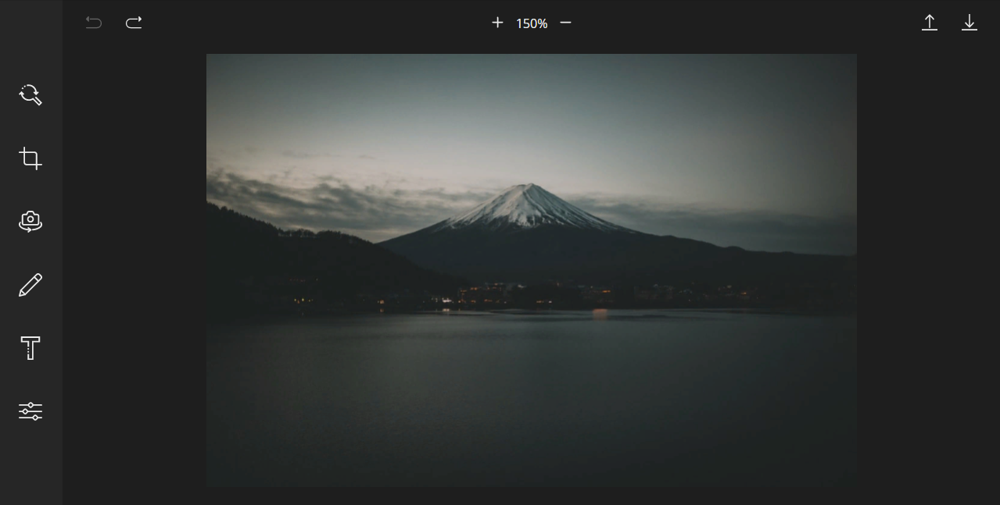
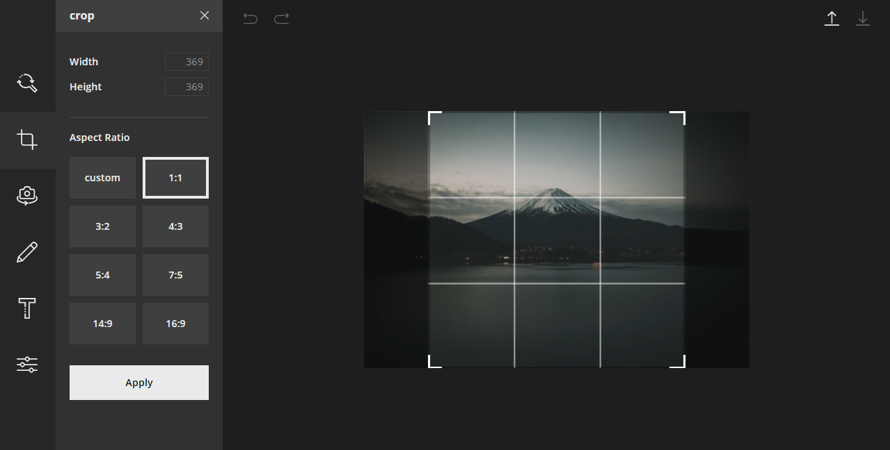
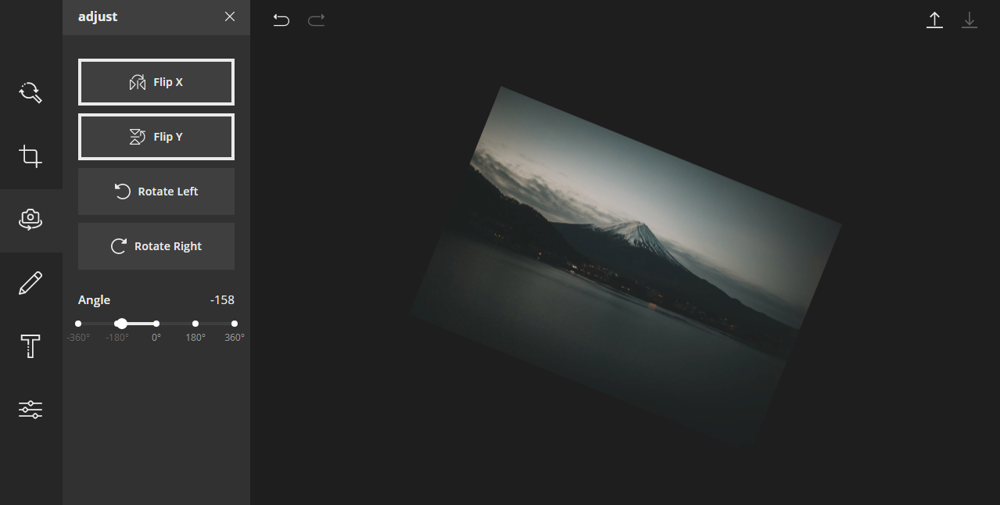
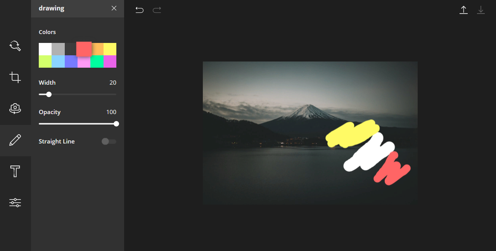
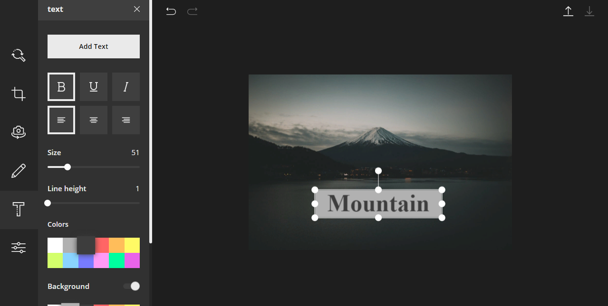
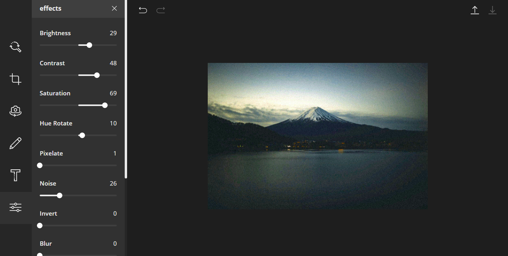
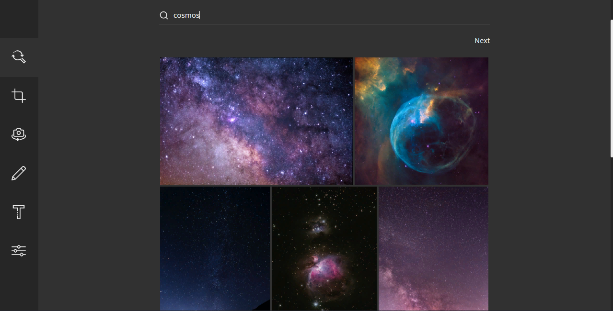

## Features

- Load Image (from Unsplash or from PC)
- Save Image
- Undo/Redo
- Crop
- Flip
- Free Rotation
- Free Drawing
- Line Drawing
- Text
- Filters
- Zoom

## Stack

- React js
- TypeScript
- MobX
- Fabricjs

## Screenshots

<pre>

</pre>

<pre>

</pre>

<pre>

</pre>

<pre>

</pre>

<pre>

</pre>

<pre>

</pre>

<pre>

</pre>
